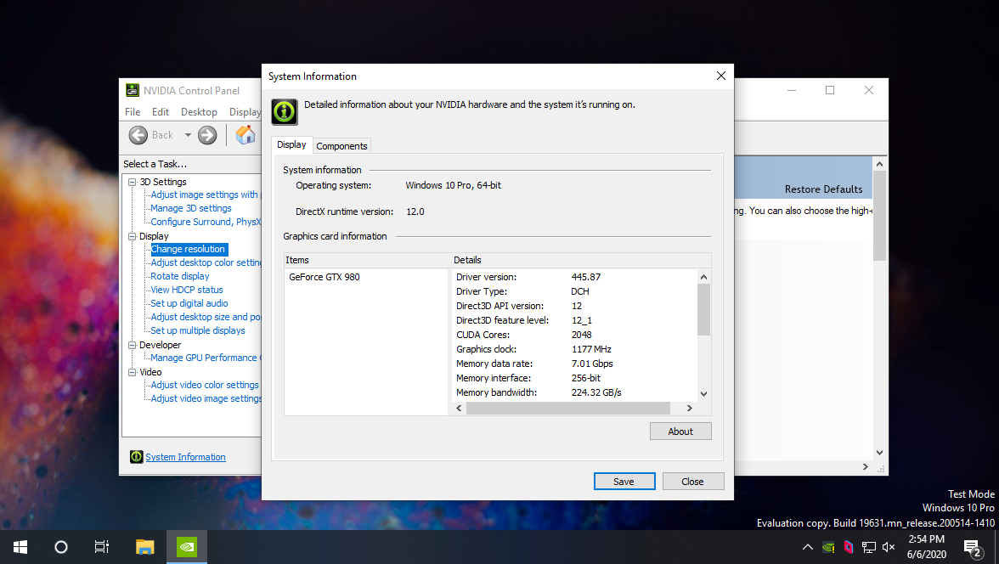

<sub>NVIDIA GeForce GTX 980 GPU via Hyper-V Virtual Machine running Windows 10</sub>

# Remove-HypervisorChecks

A PowerShell script to remove hypervisor checks in both AMD and NVIDIA consumer GPU drivers for Microsoft Windows.

> ⚠ AMD GPU drivers are not yet supported. Work to complete this support is underway.

# Usage

1. Download a driver package from [NVIDIA](https://www.nvidia.com/Download/index.aspx?lang=en-us) or [AMD](https://www.amd.com/en/support) for your GPU.
2. Open PowerShell and issue one of the following commands:

   ```powershell
   PS> ./Remove-HypervisorChecks.ps1 -Nvidia -DriverPath "path\to\driver\package.exe"
   ```

   ```powershell
   PS> ./Remove-HypervisorChecks.ps1 -Amd -DriverPath "path\to\driver\package.exe"
   ```

3. Wait for script completion.
4. Install the patched driver (patched-driver.zip) in guest virtual machine. (Test mode must be enabled as the drivers are self-signed.)

# More information

See [How To: Get Consumer GPUs Working In Hyper-V Virtual Machines](https://withinrafael.com/2020/06/06/how-to-get-consumer-gpus-working-in-hyperv-virtual-machines/)